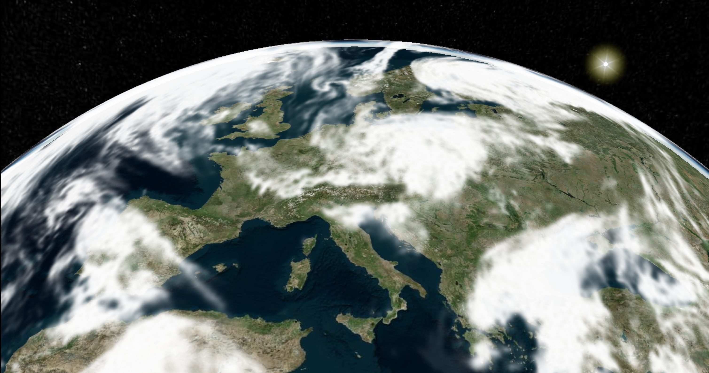

# Cesium Globe: animated cloud cover

**[🌍 DEMO 🌎](https://cesium-globe-weather.vercel.app/)**

The stack:
- language: **TypeScript**
- Bundler: **Vite**
- UI Framework: **React**
- 3D globe: **Cesium JS**
- 3D overlay: **Three JS** with custom shader
- Data: **Meteo France** ARPEGE weather forecast model (0.5° global coverage), variable **total cloud cover** ([link](https://donneespubliques.meteofrance.fr/?fond=produit&id_produit=130&id_rubrique=51))